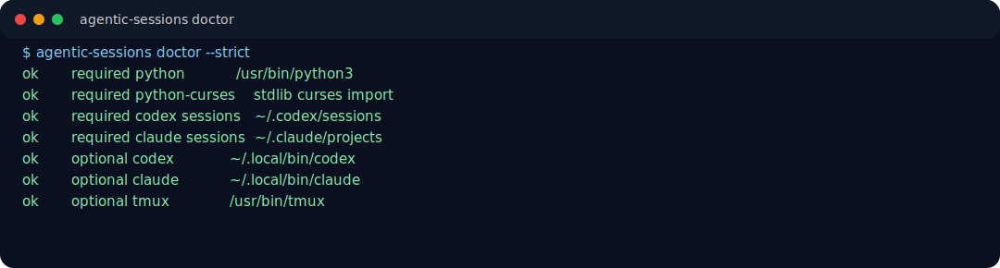
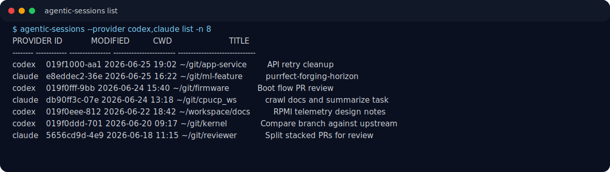
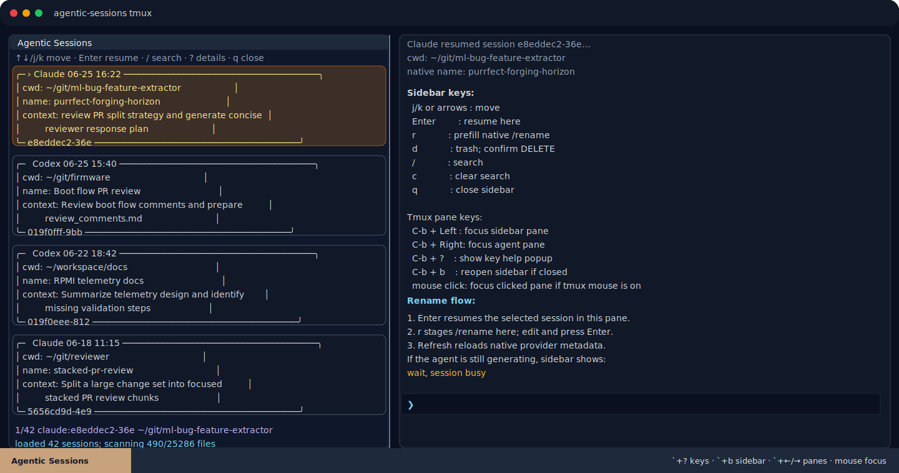

# agentic-session-tools

`agentic-session-tools` is a small, relocatable helper for browsing and resuming
Codex and Claude Code sessions without modifying either tool's session files.

It provides:

- `agentic-sessions list` — list recent Codex or Claude sessions with time, CWD, and prompt preview
- `agentic-sessions rename` — add human-friendly titles using sidecar metadata
- `agentic-sessions delete` — move session JSONL files to a recoverable trash folder
- `agentic-sessions resume` — resume by UUID, UUID prefix, or unique text fragment
- `agentic-sessions tmux` — tmux two-pane workspace with a session sidebar

The tool is intentionally dependency-light: Python 3 stdlib plus `tmux` for sidebar mode.


## Screenshots

The screenshots below use representative session data and do not expose real team session contents.

### Dependency Check



### Session List



### tmux Sidebar With Resumed Agent Session



## Requirements

Required for core commands (`paths`, `list`, `rename`, `delete`):

- Linux/macOS shell environment
- Python 3.7+
- Python stdlib modules: `argparse`, `curses`, `dataclasses`, `datetime`, `glob`, `json`, `os`, `pathlib`, `re`, `shutil`, `subprocess`, `time`
  - Note: on some Linux distributions, `curses` is packaged separately as `python3-curses`.
- Existing Codex session files under one of:
  - `$CODEX_HOME/sessions`
  - `$CODEX_HOME/agent/sessions`
  - `~/.codex/sessions`
  - `~/.config/codex/sessions`
- Or Claude Code session files under one of:
  - `$CLAUDE_CONFIG_DIR/projects`
  - `$CLAUDE_HOME/projects`
  - `~/.claude/projects`
  - `~/.config/claude/projects`

Required for resume/sidebar workflows:

- Codex installed as `codex`, available at `~/.local/bin/codex`, or configured via `CODEX_BIN=/path/to/codex`
- Claude Code installed as `claude`, available at `~/.local/bin/claude`, or configured via `CLAUDE_BIN=/path/to/claude`
- A compatible wrapper can be used by setting `CODEX_BIN` or `CLAUDE_BIN` to that executable path or command name
- `tmux` for `agentic-sessions tmux`
- A POSIX-compatible shell for tmux pane bootstrap snippets (`sh`, `bash`, or `zsh`)

Required only for installation/packaging:

- `bash` to run `install.sh`
- `install` command from GNU coreutils/BSD userland
- `tar` and `sha256sum` only if you want to recreate the shareable archive/checksum

Not required by the tool: `jq`, `fzf`, `gum`, `dialog`, `zellij`, `textual`, `prompt_toolkit`, or any Python packages outside the standard library.

Run this after install to verify a machine:

```bash
agentic-sessions doctor
```

Use `--strict` when validating full sidebar/resume readiness, including the selected agent CLI and `tmux`:

```bash
agentic-sessions doctor --strict
```

## Quick Start

From this folder:

```bash
./install.sh --aliases
# Follow the printed "Quick start" commands to reload aliases for this shell.
ags doctor
ags list -n 10
ags tmux
```

By default, `agentic-sessions` uses `--provider codex,claude` and merges sessions
from both tools by modified time. Filter to one provider when needed:

```bash
ags --provider codex list -n 10
ags --provider claude doctor
ags --provider claude list -n 10
ags --provider claude tmux
```

Without installing:

```bash
export PATH=/path/to/agentic-session-tools/bin:$PATH
agentic-sessions list -n 10
agentic-sessions tmux
```

If Codex is not in `PATH`, or you need a Codex-compatible wrapper:

```bash
export CODEX_BIN=/absolute/path/to/codex
# Optional: if sessions live outside the default Codex home
export CODEX_HOME=/absolute/path/to/codex-home-or-agent
agentic-sessions tmux
```

For Claude Code, use:

```bash
export CLAUDE_BIN=/absolute/path/to/claude
export CLAUDE_CONFIG_DIR=/absolute/path/to/claude-config
agentic-sessions --provider claude tmux
```

For machine-local defaults without changing your shell rc, create an ignored local env file next to this repo:

```bash
cat > .agentic-session-tools.env <<'EOF'
CODEX_HOME=/absolute/path/to/codex-home-or-agent
CODEX_BIN=/absolute/path/to/codex-or-compatible-wrapper
CLAUDE_CONFIG_DIR=/absolute/path/to/claude-config
CLAUDE_BIN=/absolute/path/to/claude-or-compatible-wrapper
EOF
```

## Installation

Install to `~/.local/bin`:

```bash
./install.sh
```

Install and add convenience aliases:

```bash
./install.sh --aliases
# The installer detects the running shell rc file and prints the exact reload command.
```

Install to a custom prefix:

```bash
./install.sh --prefix ~/tools
export PATH="$HOME/tools/bin:$PATH"
```

The installer copies `bin/agentic-sessions` plus a compatibility `bin/codex-sessions` wrapper; the tool remains relocatable.

`agentic-sessions` is the primary command. `codex-sessions` remains installed as
a backward-compatible entry point for existing scripts and muscle memory.


## Shell RC / Alias Notes

The tool itself does **not** require `~/.zshrc`, `~/.bashrc`, or any team-specific shell setup.

Shell rc changes are optional and only used for convenience aliases:

```bash
alias ags='/path/to/agentic-sessions '
alias cs='/path/to/agentic-sessions '
alias cxs='/path/to/codex-sessions '
```

`./install.sh --aliases` appends those aliases to the detected running shell rc file:

- zsh: `~/.zshrc`
- bash: `~/.bashrc`
- fallback: `~/.profile`

The installer cannot modify the already-running parent shell directly, so it prints
the exact command to activate aliases immediately, such as `source ~/.zshrc`.

If a teammate does not want rc-file changes, use one of these instead:

```bash
export PATH="$HOME/.local/bin:$PATH"
agentic-sessions tmux
```

or run directly:

```bash
/path/to/agentic-session-tools/bin/agentic-sessions tmux
```

If someone has a custom `codex()` or `claude()` shell function in their rc file, it is not required by this tool.
The sidebar resolves the selected provider through `CODEX_BIN`/`CLAUDE_BIN`, `PATH`, or common install locations and sends an absolute binary path when possible. If the wrong executable is selected, set:

```bash
export CODEX_BIN=/absolute/path/to/codex
export CLAUDE_BIN=/absolute/path/to/claude
```

`CODEX_BIN` and `CLAUDE_BIN` are intentionally generic: they may point to the real
CLI or a compatible wrapper executable. The tool does not hardcode wrapper names.

For teams that wrap Codex with `script` for chat logs, ensure the util-linux `script` argument order is correct on that machine. Common Linux form:

```bash
script -qf -c "/path/to/codex resume <id>" /path/to/logfile
```

BSD/macOS variants may differ; this wrapper is optional and not part of `agentic-session-tools`.

## Commands

Show detected paths and dependency status:

```bash
agentic-sessions paths
agentic-sessions doctor
agentic-sessions doctor --strict
agentic-sessions --provider claude doctor
```

List sessions:

```bash
agentic-sessions list -n 20
agentic-sessions --provider codex,claude list -n 20
agentic-sessions --provider codex list -n 20
agentic-sessions --provider claude list -n 20
agentic-sessions list -q rv_github
agentic-sessions list --long
agentic-sessions list --json
agentic-sessions --provider codex list --all  # include generated child/background rollouts
```

The default and explicit `--provider codex,claude` modes interleave providers by
modified time. If the newest rows are all from one provider, increase `-n` or filter
with `--provider codex` / `--provider claude`.
Default views show top-level interactive sessions only so generated child,
background, and SDK probe sessions do not flood the list; use `--all` when you
need to inspect raw session files.

Rename a session using sidecar metadata:

```bash
agentic-sessions rename 019eda11 "RPMI telemetry docs"
agentic-sessions rename 019eda11 ""   # clear custom title
```

Resume a session:

```bash
agentic-sessions resume 019eda11
agentic-sessions resume "RPMI telemetry"
agentic-sessions --provider claude resume 5656cd9d
```

Claude Code resume is run from the session's saved working directory because
Claude stores resumable conversations in project-scoped history.

Trash a session JSONL file:

```bash
agentic-sessions delete 019eda11
```

Launch the tmux sidebar:

```bash
agentic-sessions tmux
agentic-sessions --provider claude tmux
```

Inside an existing tmux session, `tmux` mode splits the current window into panes.
Outside tmux, it creates a new tmux session with one window and two panes.

## tmux Sidebar Keys

- `j` / `k` or arrow keys: move selection
- `Enter`: suspend the current right-pane agent with `Ctrl-Z`, resume selected session, and focus that pane
- `r`: rename selected session
- `d`: trash selected session after typing `DELETE`
- `/`: search/filter sessions
- `c`: clear search filter
- `R`: refresh cached session list
- `q`: close the sidebar pane
- detected tmux prefix + `Left`: focus the sidebar pane from the agent pane
- detected tmux prefix + `Right`: focus the agent pane from the sidebar pane
- mouse click: focus the clicked pane when tmux mouse mode is enabled

The sidebar caches the session list for fast arrow-key navigation. It reloads only on
search, clear, rename, delete, or manual refresh.
The runtime help prints your configured tmux prefix directly, for example
`C-b + Left` or `C-a + Left`.
When the terminal supports colors, the sidebar uses a muted Claude-style palette
for the header, selected row, help, and status lines; monochrome terminals fall
back to plain reverse/dim text.
When `Enter` switches sessions, the previously running right-pane agent is left as
a suspended shell job rather than killed; run `jobs` or `fg` in that pane if you
need to inspect or return to it.

The sidebar indexes all top-level sessions by default, not just the first page.
Visible rows are enriched with prompt/CWD details as you scroll. Generated child,
background, and SDK probe sessions are hidden unless you run the hidden sidebar
command with `--all` for raw-file inspection.

## Optional tmux Configuration

The installer adds `set -g mouse on` to `~/.tmux.conf` when no tmux mouse setting
is already present, so clicking a pane focuses it. Pass `--no-tmux-mouse` to skip
that change, or `--tmux /path/to/tmux.conf` to choose a different config file.

If you also want copy-on-drag and quick pane switching, add a local tmux snippet
such as:

```tmux
set -g mouse on

# Copy selected text to the X clipboard when mouse drag selection ends.
# Requires xclip on Linux/X11 systems.
bind-key -T copy-mode-vi MouseDragEnd1Pane send-keys -X copy-pipe-and-cancel "xclip -se c -i"
bind-key -T copy-mode MouseDragEnd1Pane send-keys -X copy-pipe-and-cancel "xclip -se c -i"

# Shift-left/right pane switching. Terminal support for these keys may vary.
bind -n S-Right select-pane -t :.+
bind -n S-Left select-pane -t :.-
```

Reload tmux configuration after editing:

```bash
tmux source-file ~/.tmux.conf
```

## Working Directory Prompt

Codex or Claude may ask follow-up questions in the right pane. For example, Codex may ask:

```text
Choose working directory to resume this session
1. Use session directory (...)
2. Use current directory (...)
```

After selecting a session from the sidebar, focus should automatically move to the
right pane. Press `Enter` to accept the default, or choose the desired option there.
Use the displayed tmux prefix + `Left` to return to the sidebar pane.

## Safety Model

The tool does not edit Codex or Claude session JSONL files for normal metadata operations.

- Custom names are stored in sidecar metadata:
  - Codex: `~/.codex/session-tools/session-names.json`
  - Claude: `~/.claude/session-tools/session-names.json`
- Delete/trash moves rollout files into:
  - Codex: `~/.codex/session-tools/trash/`
  - Claude: `~/.claude/session-tools/trash/`
- Trash operations append a manifest:
  - `trash/manifest.jsonl` under the selected provider's state root

Use `--state-root DIR` to keep metadata somewhere else.

## Configuration Overrides

Use these when auto-detection does not match your setup:

```bash
agentic-sessions --agent-home /path/to/agent paths
agentic-sessions --sessions-root /path/to/sessions list
agentic-sessions --state-root /path/to/state rename <id> "Title"
agentic-sessions tmux --codex-bin /path/to/codex
agentic-sessions --provider claude --agent-home /path/to/.claude paths
agentic-sessions --provider claude tmux --claude-bin /path/to/claude
```

Environment variables:

- `AGENTIC_SESSION_PROVIDER`: default provider list, for example `codex`, `claude`, or `codex,claude`; default is `codex,claude`
- `CODEX_SESSION_PROVIDER`: legacy default-provider variable, still honored
- `CODEX_BIN`: explicit Codex binary path
- `CODEX_HOME`: agent home containing `sessions/`, or CLI home containing `agent/sessions/`
- `CODEX_SESSIONS_ROOT`: explicit rollout JSONL session root; overrides `CODEX_HOME`
- `AGENTIC_SESSION_TOOLS_HOME`: sidecar metadata root for both providers
- `CODEX_SESSION_TOOLS_HOME`: legacy sidecar metadata root, still honored
- `CLAUDE_BIN`: explicit Claude Code binary path
- `CLAUDE_CONFIG_DIR` or `CLAUDE_HOME`: Claude config dir containing `projects/`
- `CLAUDE_SESSIONS_ROOT`: explicit Claude JSONL session root; overrides `CLAUDE_CONFIG_DIR`
- `CLAUDE_SESSION_TOOLS_HOME`: Claude sidecar metadata root

## Validation Status

This package was smoke-tested in a clean Docker container based on Ubuntu with Python 3.8.10, no `tmux`, and no real Codex installed. The script is kept Python 3.7-compatible for older hosts. Validated paths:

- `install.sh --prefix ... --aliases --shell ...`
- `agentic-sessions doctor` with missing optional agent/tmux warnings
- `agentic-sessions doctor --strict` failing when optional sidebar/resume deps are absent
- `list`, `rename`, `delete`, and trash manifest using fake session JSONL
- `resume` using a fake `codex` binary in `PATH`
- `--provider claude` paths, doctor, list, resume command rendering, and tmux dry-run against local Claude Code JSONL sessions

The tmux sidebar was validated on the host environment where real `tmux` is available.

## Troubleshooting

### `codex: command not found` after pressing Enter

Restart the sidebar after updating this tool. The current sidebar process may still
be using old code. Also verify:

```bash
agentic-sessions resume <id> --print-command
```

It should print an absolute Codex path when Codex is installed in `~/.local/bin`.
If not, set:

```bash
export CODEX_BIN=/absolute/path/to/codex
```

For Claude sessions, use:

```bash
agentic-sessions --provider claude resume <id> --print-command
export CLAUDE_BIN=/absolute/path/to/claude
```

### Sidebar opens but arrows feel slow

Use the latest version of this tool. The sidebar should cache sessions and move
without reparsing JSONL on every keypress. Press `R` to refresh manually.

### Sidebar creates a new window inside tmux

Use the latest version. Inside tmux, `agentic-sessions tmux` should split the current
window, not create a new window.

### I am stuck at Codex's working-directory prompt

Move to the right pane with your tmux prefix + arrow key, or restart with the latest
tool version. Current versions automatically focus the right pane after `Enter`.

### Session list is missing expected sessions

Check detected paths:

```bash
agentic-sessions paths
```

Then override if needed:

```bash
agentic-sessions --sessions-root /path/to/sessions list -n 20
agentic-sessions --provider claude --sessions-root /path/to/claude/projects list -n 20
```

## Sharing With Teammates

Recommended options:

1. Share the directory as-is:

   ```bash
   tar -czf agentic-session-tools.tar.gz agentic-session-tools
   ```

2. Teammates unpack and install:

   ```bash
   tar -xzf agentic-session-tools.tar.gz
   cd agentic-session-tools
   ./install.sh --aliases
   # Follow the printed "Quick start" commands.
   ags tmux
   ```

3. Or run directly without installation:

   ```bash
   ./bin/agentic-sessions list -n 10
   ./bin/agentic-sessions tmux
   ```

## Uninstall

If installed to `~/.local/bin`:

```bash
rm -f ~/.local/bin/agentic-sessions
rm -f ~/.local/bin/codex-sessions
```

If aliases were added, remove this block from your shell rc file:

```bash
# agentic-session-tools aliases
alias ags='.../agentic-sessions '
alias cs='.../agentic-sessions '
alias cxs='.../codex-sessions '
```

Sidecar metadata is not removed automatically. To remove it:

```bash
rm -rf ~/.codex/session-tools
rm -rf ~/.claude/session-tools
```

Review the trash folder before deleting it if you used `delete`.
